# Employee Details Management Application
A simple app performing CRUD operations using React, Spring Boot, MySQL and Apache server

### Initial status of the Employee Management database

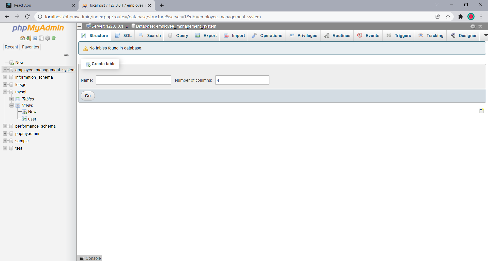

### The Employee table is created upon running Spring Boot

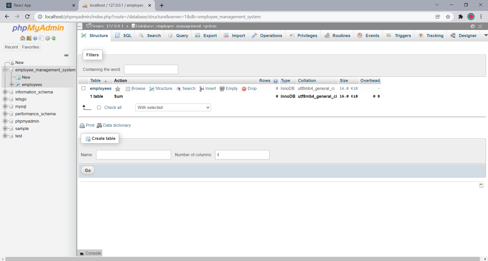

### Employee details initially upon running React

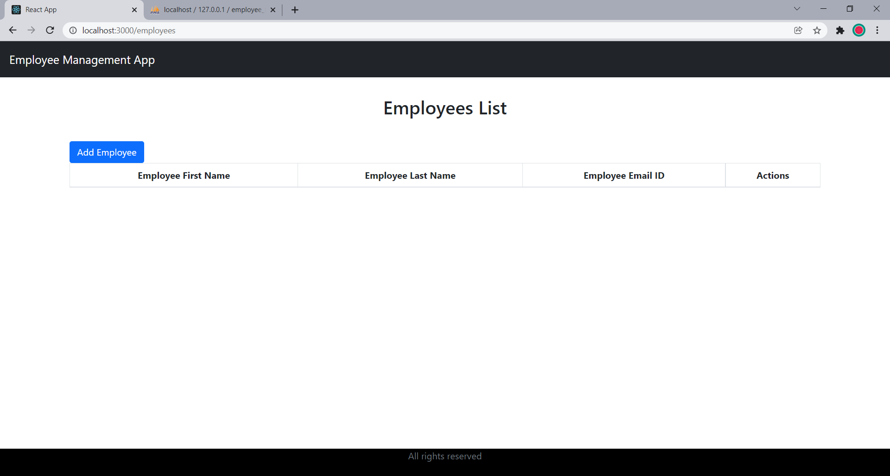

### Adding a new employee's details

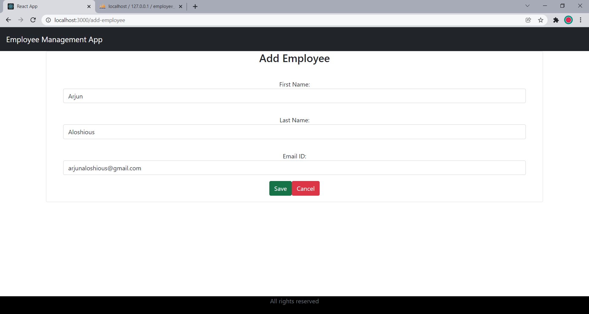

### Details added in front-end

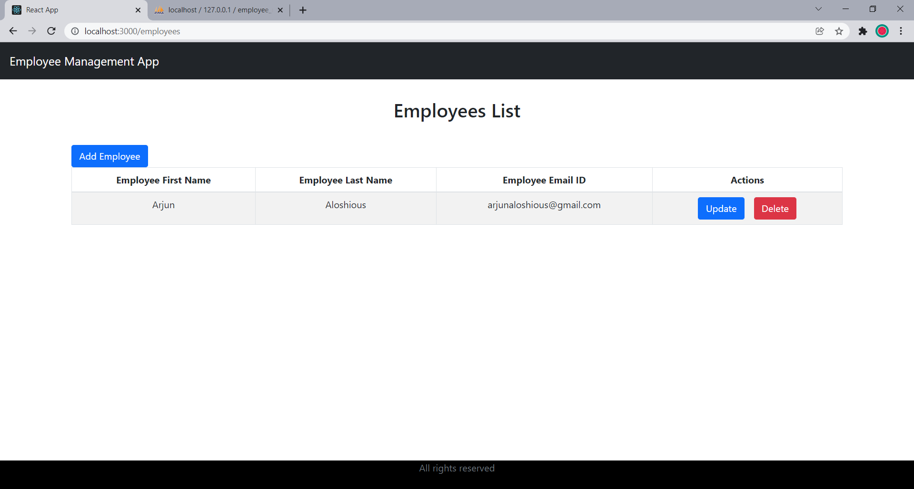

### Details added in back-end

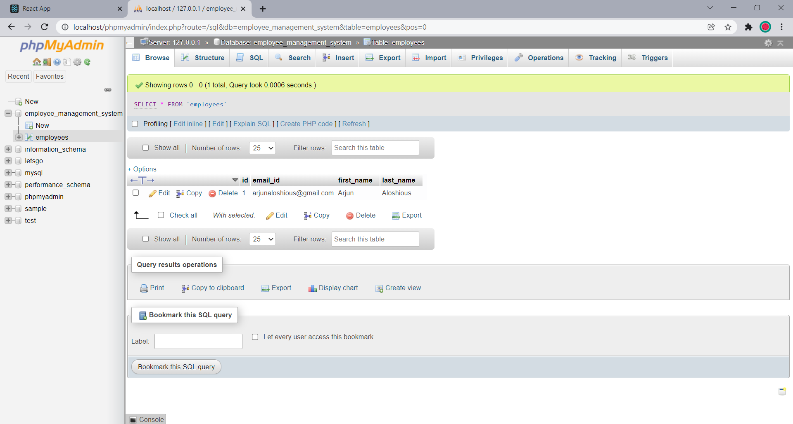

### Employee details after adding a few more entries

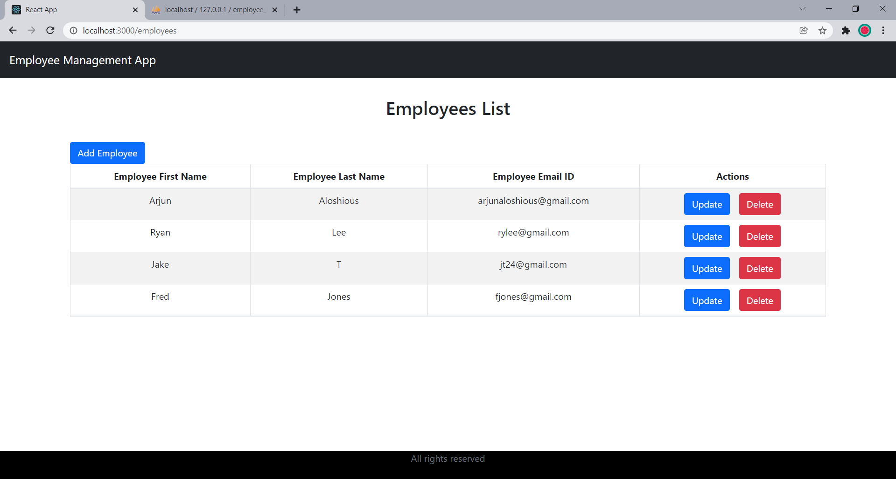

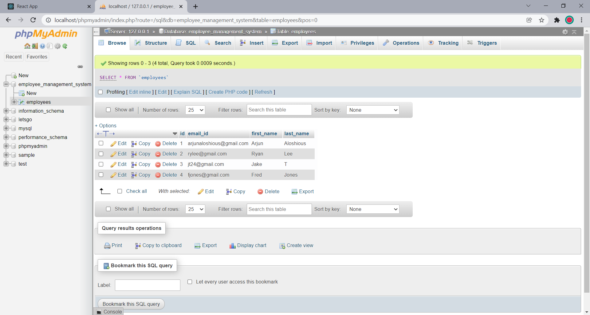

### After choosing the Update option on the first employee's details

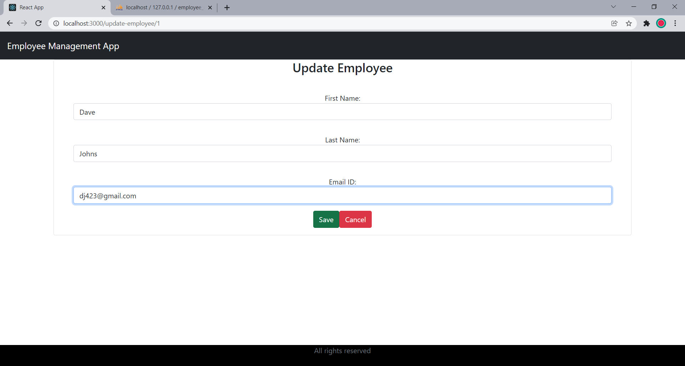

### The corresponding changes are reflected in the entries

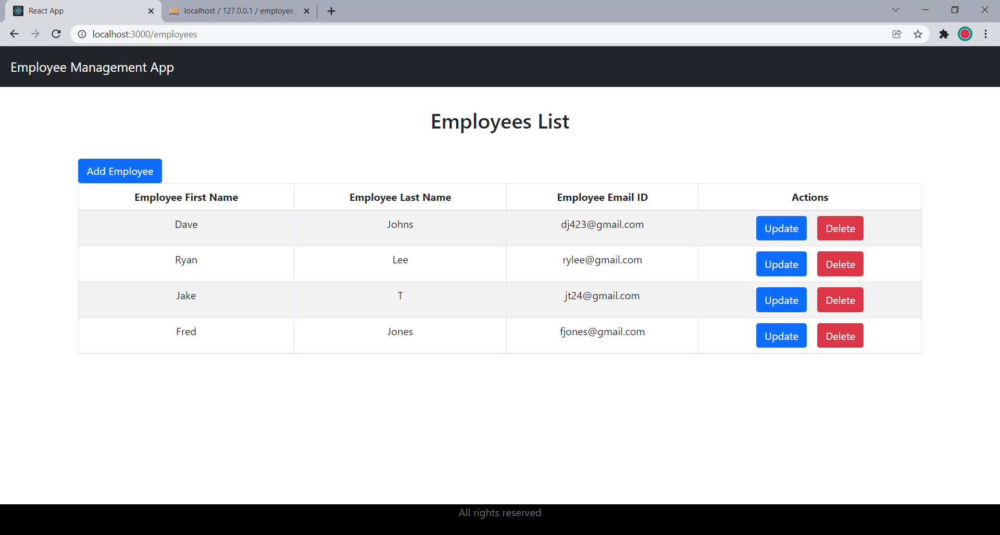

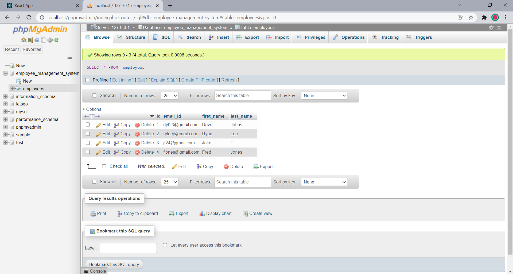

### After choosing the Delete option on the second employee's details, the entries are removed

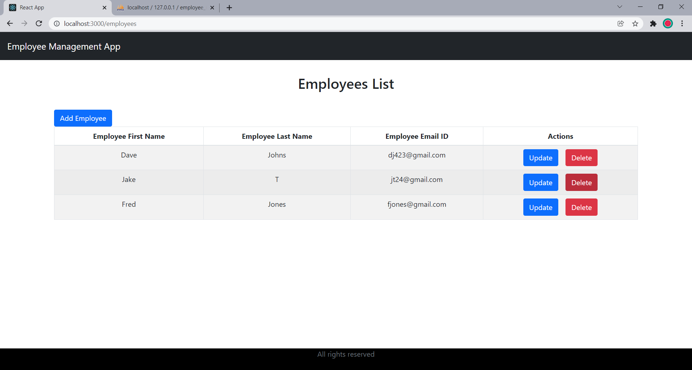

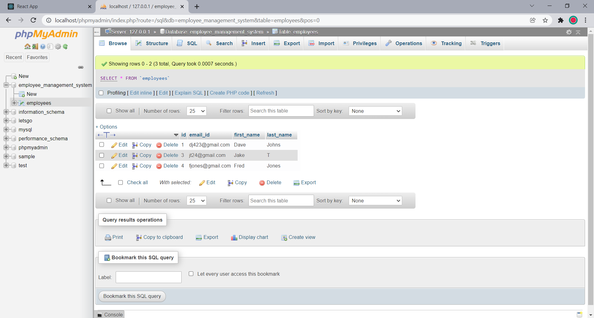
